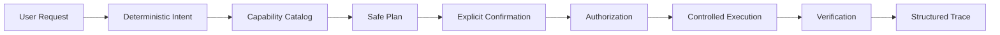
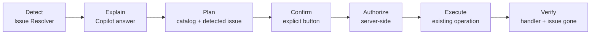

# ✨ IRIS Command Center

**Observe. Investigate. Act—safely.**

A modern operational console for **InterSystems IRIS** that brings monitoring, administration, investigation, security, visibility, issue resolution, and operational tracing into one place.
It combines live IRIS system information with controlled administrative workflows, native audit investigation, structured execution traces, security visibility, and **IRIS Ops Skill** — a reusable, safety-oriented AI operations capability that explains live IRIS issues and resolves a closed set of approved problems only through deterministic planning, explicit confirmation, authorization, verification and tracing.
<p align="center">

</p>
<p align="center">
  <a href="https://www.intersystems.com/"></a>
  <a href="https://fastapi.tiangolo.com/"></a>
  <a href="https://www.python.org/"></a>
  <a href="https://developer.mozilla.org/en-US/docs/Web/JavaScript"></a>
  <a href="https://www.intersystems.com/resources/technology/vector-search/"></a>
  <a href="https://www.intersystems.com/"></a>
  <a href="https://www.docker.com/"></a>
  <a href="https://docs.intersystems.com/irislatest/csp/docbook/DocBook.UI.Page.cls?KEY=GIPM"></a>
  <a href="https://opensource.org/licenses/MIT"></a>
</p>

---

## 🏗️ Architecture


---
## 🏆 IRIS Ops Skill — What Makes It Different

IRIS Ops Skill turns IRIS Command Center from an operational dashboard into a
**safety-oriented AI operations capability for InterSystems IRIS**.

It is not an unrestricted AI agent connected directly to IRIS. The Copilot is
deterministic and rule-based (no LLM or external AI service is involved), and it
operates inside a server-side safety boundary:

**Ask → Detect → Explain → Plan → Confirm → Authorize → Execute → Verify → Trace**

### Key Enhancements

| Enhancement | What it provides |
|---|---|
| 🧩 **Closed Capability Catalog** | A single allowlist of approved AI operations. The Copilot cannot invent or execute arbitrary operations. |
| 📋 **Rich Capability Metadata** | Each capability declares examples, constraints, verification and undo information, while privileges and risk come from the existing operation registry. |
| ⏱️ **Task Catalog** | Ask natural-language questions about live IRIS tasks, including suspended tasks, errors, schedules and run-as users — completely read-only. |
| 🔎 **Capability Discovery** | A read-only API exposes the currently approved capabilities and their metadata without exposing handlers or implementation details. |
| 🧵 **Structured Execution Trace** | Planning and execution produce linked `copilot.plan` and `copilot.execute` traces connected to the underlying operation trace. |
| 🛡️ **Structured Failure States** | Rejections and failures use machine-readable codes such as `authorization_failed`, `resource_protected`, `verification_failed` and `issue_still_detected`. |
| 🔐 **Defense in Depth** | AI output is only a proposal. Parameters are rebuilt server-side, authorization is rechecked, explicit confirmation is required, and every mutation is verified. |

### The safety architecture


    
### Why this matters

The Copilot is not an unrestricted AI agent with an IRIS connection.
It is an **issue-aware, allowlisted operations layer** built on top of the
Command Center's existing authorization, execution and observability
frameworks.

---

# 🧭 Features at a Glance

| Area | What you can do |
|---|---|
| 🖥️ **Instances (Multi-IRIS)** | Register and manage multiple IRIS 2026.2+ instances, securely store connection credentials, test compatibility, monitor active instances through Fleet Overview, and switch supported read screens to any active instance |
| 📊 **Dashboard** | View live system state, databases, processes, web apps, tasks, resources, alerts, Issues & Recommendations, and recent activity |
| 🩺 **Health Center** | Review overall health and assessment coverage across six categories, with live Current Activity and an informational Performance Snapshot |
| 🩺 **Issue Resolver** | Detect supported issues from live IRIS evidence, distinguish resolvable and detection-only issues, define custom detection rules, investigate or resolve safely, verify results, and follow the execution trace |
| 🗂️ **Namespaces** | Explore namespaces, relationships, and create namespaces safely |
| 💾 **Databases** | Inspect databases, storage, integrity, and perform controlled create, mount, and dismount workflows |
| ⚙️ **Processes** | Search, filter, and investigate live IRIS processes |
| 🌐 **Web Applications** | Inspect configuration, REST applications, sessions, enable/disable apps, and update descriptions |
| 🔍 **REST API Explorer** | Explore generated REST API definitions, endpoints, methods, parameters, and implementation details |
| ⏱️ **Tasks** | Monitor live task state, upcoming runs, schedules, and most recent run information, with task details and supported Run Now workflows |
| 🔐 **Security** | Explore users, roles, resources, authentication posture, wallets, X.509, and OAuth2 |
| 🔌 **Extensions & Integrations** | Inspect external language servers, filesystem access purposes, and wallet integration metadata |
| 🔎 **Investigation** | Search the native IRIS security audit trail and relate activity to Command Center traces |
| 👁️ **Observability** | Inspect structured execution traces and optionally persist them inside IRIS |
| 🤖 **AI Assistant / IRIS Ops Skill** | Issue-aware AI operations over live IRIS data with a closed capability catalog, read-only Task Catalog, explicit confirmation, server-side authorization, structured execution traces, and machine-readable failure states |
| 🔍 **Vector Search** | Search an IRIS-persisted operational knowledge corpus using IRIS Vector Search |
| 🐍 **Embedded Python** | Inspect live diagnostics from IRIS Embedded Python |
| 🖥️ **Instances (Multi-IRIS)** | Register additional IRIS 2026.2+ instances, test their compatibility, open any active instance with the instance selector in each page's header, and monitor all active instances in the Fleet Overview |
| 🎬 **Demo Activity** | Demonstrate controlled operations and an intentional, reversible demo issue, with verification, restoration, and execution tracing |

---

# 🛰️ Multi-IRIS Instances & Fleet Overview

IRIS Command Center can manage and monitor several IRIS instances from one interface. You register connections on the **Instances** screen, check that they are compatible, and then monitor every active instance side by side in the **Fleet Overview** or open any single instance on the instance-aware screens.

- **Primary instance** — the IRIS instance configured in the backend environment (`IRIS_BASE_URL`, `IRIS_USERNAME`, `IRIS_PASSWORD`). It is always available and can't be edited or deleted from the UI.
- **User-defined connections** — additional IRIS 2026.2+ instances you add yourself (name, URL, username, namespace, password).
- **Secure credential storage** — passwords are stored in the **IRIS Secure Wallet**, never in plain text. Passwords and credential references are never returned by the API or shown in the browser.
- **Connection testing and compatibility** — a connection is tested before it is saved, and can be re-checked at any time.
- **Active / inactive** — only active connections can be selected and monitored; an inactive connection is kept but ignored.
- **Instance-specific monitoring** — instance-aware screens have an instance selector in their page header. The browser sends only the instance id; the backend resolves the connection and credentials.
- **Fleet Overview** — one read-only page showing every active instance together.
- **Protected instances** — the Primary and the Docker-managed **IRIS-2** (the `iris-2` Docker Compose service) can't be edited or deleted; the backend refuses these changes too.

All instance changes (add, edit, activate, deactivate, delete) go through the same authorization → confirmation → execution → verification → trace framework as other Command Center operations.

## 1. Adding a New Connection

1. Open **Instances** in the sidebar.
2. Select **Add Instance**.
3. Enter the **Name**, **URL** (for example `http://iris-host:52773`), **Username**, **Namespace** and **Password**.
4. Select **Test Connection**. The backend runs a live compatibility check:
   - the instance must be **InterSystems IRIS 2026.2 or later**;
   - the System Administration API (`/api/admin`, API v2) and every Management API endpoint Command Center uses must answer.

   The result is shown as **Compatible**, **Incompatible** (with the reported IRIS version), **Unreachable** or **Auth Failed**.
5. After a compatible test, confirm (*"I confirm that I want to add this instance."*) and select **Add Instance**. Changing any field afterwards requires a new test.
6. The connection is saved and active. Its definition is stored in IRIS (`^CommandCenterInstance`) and its password in the IRIS Secure Wallet.


## 2. Viewing Connections

The **Instances** screen lists every registered connection with its **Name**, **ID**, **URL**, **Username**, **Namespace**, **Status** and **Last Check**.

- **Status** — **Active** or **Inactive**, plus the result of the last compatibility check (**Compatible**, **Incompatible**, **Unreachable**, **Auth Failed**).
- **Last Check** — when the connection was last checked; for a failed check, the reason is shown below the time.
- **Check** re-runs the compatibility check at any time.
- **Edit** tests the changed connection as a dry run first; nothing is saved until you confirm. Leaving the password empty keeps the stored one.
- **Activate**, **Deactivate** and **Delete** ask for explicit confirmation. Activating re-checks compatibility first.


## 3. Fleet Overview

**Fleet Overview** (*All Active Instances*) gives a compact, read-only monitoring view of all active IRIS instances, with an independent card for each instance. It is meant for a quick operational comparison without opening each instance separately. Values are never added up across instances.

Each instance card shows its name and host, a **View Details →** button, and three rows:

- **Issues** is the number of active issues found by the issue checks — the same list as the Issue Resolver for that instance.
- **Processes**, **Global References /sec** and **Web Sessions** show small live charts. They are sampled only while the page is open (every 15 s, with a full read every 60 s); no history is stored.
- **Resources** are the counts of the lists shown on the Namespaces, Databases, Web Apps and Tasks pages.
- Most metrics have a link (or **View →**) that selects that instance and opens the matching page.
- Inactive instances are not shown; a note says how many are hidden.
- Each instance is read on its own. If one instance can't be read, only its card is marked unavailable and its links are disabled; the other cards keep loading, and nothing falls back to another instance.


---

# 🤖 IRIS Ops Skill — Issue-aware Copilot

**IRIS Ops Skill** is a reusable, safety-oriented AI operations capability for InterSystems IRIS. It answers operational questions from live, read-only IRIS evidence and can resolve a small, closed set of approved problems — but only through a deterministic plan, explicit confirmation, server-side authorization, the existing operation executor and post-change verification, with every step traced.

It is not a separate chatbot: it is surfaced through the existing **AI Assistant** page and reuses the same backend services, operation registry, authorization, execution framework and observability as the rest of Command Center.



**Detect → Explain → Plan → Confirm → Authorize → Execute → Verify**

### How the Copilot works

1. **Deterministic intent classification.** Every request is classified on the backend as an issue investigation, a health question, a read-only query, a resolution (change) request, or unknown. No model decides the intent.
2. **Read-only IRIS context.** Answers are built from a bounded snapshot of live data read through existing read-only routes: system info, databases, processes, web applications, tasks and the Issue Resolver's active issues (at most 10 items per source, long text capped). Gathering context never writes to IRIS.
3. **Structured responses.** A local, deterministic, rule-based provider returns a structured answer — `answer`, `observations`, `proposed_action`, `requires_confirmation` — with no external service or API key. Its output is descriptive; a proposed action is only a proposal.
4. **Safety/planning gateway.** Deterministic backend code turns a proposal into a plan only for an approved capability. For issue-backed operations, the request's name only *selects* one currently detected issue; the plan's target and parameters are built from that issue and the Issue Resolution Catalog, never from the user's text.
5. **Authorization and explicit confirmation.** Only the **Confirm & Execute** button confirms a plan; typing "yes" in the chat does not. Privileges are checked on the server from the IRIS session and checked again when the operation runs.
6. **Controlled execution and verification.** The plan runs through the existing operation executor and handler. Success requires the handler's post-action verification *and* the Copilot's own check — the Issue Resolver no longer reports the issue, or the journal setting reads back as requested.

### Closed capability catalog

The Copilot can only plan and run operations listed in one closed catalog (`backend/app/copilot/capabilities.py`). Planning, plan validation and execution all read it; anything not listed — including other operations the Command Center supports on its own pages — is refused.

| Capability | Title | Resolves | Example request | Verification status |
|---|---|---|---|---|
| `journal.update_purge_archived` | Set journal PurgeArchived | direct setting request | "Enable PurgeArchived" | ✅ Live-verified on IRIS 2026.2 |
| `database.mount` | Mount a dismounted database | `database_dismounted` | "Mount database IPM" | ✅ Live-verified on IRIS 2026.2 (IPM mounted, issue cleared, resolution history recorded) |
| `web_app.set_enabled` (disable only) | Disable a web application whose namespace is missing | `web_app_namespace_missing` | "Disable web app /csp/example" | 🧪 Covered by automated tests; **not yet live-verified** |

#### Example — controlled administrative action

A natural-language request does not execute an IRIS mutation directly. The Copilot
first produces a deterministic proposal and requires explicit user confirmation
before authorization and execution.

> **"Enable PurgeArchived."**


*The Copilot proposes the approved operation and requires explicit confirmation before execution.*

The catalog is validated when the backend starts; a misconfigured entry stops startup instead of failing at runtime. Every capability must be a registered mutation in the operation registry that requires confirmation, and each issue-backed capability must match the operation the Issue Resolution Catalog uses for that issue.

### Capability metadata and discovery

Each capability carries descriptive metadata: a **title**, **example requests**, the Copilot's own **constraints** (for example *"disable only"* or *"always mounted read-write"*), a **verification** description (what must hold before success is reported) and an **undo** hint.

`GET /api/iris/copilot/capabilities` lists the catalog read-only. Privileges, risk level and the confirmation rule are read from the operation registry, and the issue title and severity from the Issue Resolution Catalog, at request time — nothing is copied. Handlers and parameter models are never exposed.

### Task catalog (read-only)

The Copilot answers task questions from the existing task overview — for example *"Which tasks are suspended?"* or *"Which tasks run as _SYSTEM?"*:

- **Inventory and state:** name, type, namespace, state (Running / Not Running / Suspended, read from each task's `/v2/task/info`), suspended flag, error text (capped), last and next run.
- **Task details:** run-as user, schedule fields as IRIS reports them (TimePeriod, every, DailyFrequency, DailyStartTime) and suspend-on-error. These are read from `GET /v2/task` only when the question asks about them.
- **Bounded:** at most 10 tasks are included, and summaries say when they cover only the tasks shown. If one task's info or detail can't be read, that task is still listed with those fields empty.

#### Example — natural-language Task Catalog query

The Copilot can inspect live IRIS task state without being granted permission to modify tasks.

> **"Which tasks are suspended?"**


*Live read-only task information returned by the IRIS Ops Skill.*

Task management is **read-only**: the Copilot never runs, suspends, resumes, deletes or schedules tasks, and task operations are not in the capability catalog.

### Structured execution trace

Each Copilot change request is recorded with the existing execution-trace infrastructure (the same store, optional IRIS persistence and `GET /api/iris/observability/traces` endpoint), as two linked traces with one span per lifecycle stage:

- **`copilot.plan`** (from `/plan`, change requests only): `requested → classified → issue_detected → plan_created → confirmation_required`, or `plan_rejected` with the planner's reason.
- **`copilot.execute`** (from `/execute`): `requested → confirmation_received → authorized → issue_detected → executing → executed → verification → resolved`, or a failure stage named by its failure code.

The plan returns the plan trace's `trace_id`, the execute trace links to it, and the `executed` stage links to the executor's own operation trace. Trace IDs are informational only and never affect a decision. Trace attributes are limited to an allowlist of keys and simple values: raw user messages and secrets are never recorded (only the message length). Read-only questions create no trace, and Copilot traces do not add duplicate entries to an issue's resolution history.

#### Example — Copilot execution trace

Copilot planning and execution are visible in the same Observability infrastructure
used by the rest of Command Center.


*Copilot planning and execution provide an auditable lifecycle from request through verification.*

### Structured failure states

`POST /api/iris/copilot/execute` returns a machine-readable `failure` code (`null` on success) alongside the broad `status` and the human-readable `detail`. The same code names the failure stage of the `copilot.execute` trace:

| Failure code | Meaning |
|---|---|
| `plan_rejected` | The plan is not for an approved capability (or, in a plan trace, the planner refused the request) |
| `authorization_failed` | Not explicitly confirmed, not authorized, the authorization does not match the plan, or IRIS requires a privilege the session lacks (such as `%Admin_Secure`) |
| `issue_not_detected` | The issue is no longer detected (or the issues could not be read) when the operation is about to run |
| `target_changed` | The plan's target is invalid, differs from the authorized target, or no longer matches the detected issue |
| `parameter_mismatch` | The submitted parameters differ from those rebuilt from the detected issue |
| `resource_protected` | The target is a protected resource (system or mirrored database, System or Command Center web application) |
| `execution_failed` | The operation did not complete successfully |
| `verification_failed` | The operation ran, but its verification did not pass |
| `issue_still_detected` | The operation was verified, but the Issue Resolver still reports the issue |

`POST /api/iris/copilot/plan` keeps its own `reason` field (for example `issue_not_detected`, `ambiguous_target` or `resource_protected`) when no plan is created.

### Safety guarantees

- **Closed, allowlisted operations.** Only the three catalog capabilities can be planned or executed; unsupported or unknown operations are refused.
- **AI output is only a proposal.** The provider returns text such as *"Mount database IPM"*. It never supplies operation parameters and cannot call IRIS.
- **Parameters come from the detected issue and the catalog.** Ambiguous, undetected or protected targets are refused.
- **Fresh checks at execution time.** The issue is re-detected by its stable issue ID, parameters are rebuilt from it, and authorization is re-checked on the server. A plan whose target or parameters were changed in the browser does not match and is refused before anything reaches IRIS.
- **Explicit confirmation before any change.** Nothing is executed without the **Confirm & Execute** button.
- **Protected resources.** IRIS system and mirrored databases, System web applications and the web applications the Command Center itself uses are never changed.
- **Verification after every change.** Success requires the handler's verification and the Copilot's own check; the attempt is recorded in the operation's trace (and, for issue-backed operations, in the issue's resolution history).
- **No arbitrary execution path.** The Copilot has no SQL, ObjectScript, shell, Python or arbitrary database access; every change goes through a registered operation handler.

### Copilot API

| Method & path | Purpose |
|---|---|
| `GET /api/iris/copilot/context` | The bounded, read-only operational context (including active issues and task details) |
| `GET /api/iris/copilot/capabilities` | The closed capability catalog with its metadata (read-only) |
| `POST /api/iris/copilot/classify` | Deterministic intent of a message |
| `POST /api/iris/copilot/ask` | Structured, read-only answer (`answer`, `observations`, `proposed_action`, `requires_confirmation`) |
| `POST /api/iris/copilot/plan` | Turns a proposal into a plan (or a `reason` why not); returns the plan's `trace_id` |
| `POST /api/iris/copilot/authorize` | Checks a plan against the caller's privileges and the confirmation rule; executes nothing |
| `POST /api/iris/copilot/execute` | Executes an authorized, confirmed plan and verifies it; returns `status`, `failure`, `detail` and `trace_id` |

### Current limitations

- `web_app.set_enabled` is covered by automated tests but has not yet been verified against a live IRIS instance.
- `journal.update_purge_archived` is a direct setting request, so when run from the Copilot it is not linked to the Issue Resolver's resolution history.
- The deterministic provider understands specific phrasings (see each capability's example requests).
- Task management is read-only, and task summaries cover at most the 10 tasks included in the context.
- Execution traces are kept in memory (newest 200) unless `PERSIST_TRACES_TO_IRIS` is enabled.

➡️ **Demo walkthrough:** [docs/ops-skill-demo.md](docs/ops-skill-demo.md)

---

# 📦 Installation

## Prerequisites

- Docker Desktop / Docker Engine
- Docker Compose
- Git

## Docker 

### 1. Clone

```bash
git clone https://github.com/mwaseem75/iris-command-center.git
cd iris-command-center
```

### 2. Configure environment

Copy the example file:

```bash
cp .env.example .env
```

On Windows PowerShell:

```powershell
Copy-Item .env.example .env
```

Edit `.env` with the credentials for the IRIS environment used by the Docker stack.
Set `IRIS2_PASSWORD` too: it becomes the password of the second IRIS instance (`iris-2`, see below).

> **Do not commit `.env`.** It is intentionally excluded from the Docker build context.

### 3. Builds & starts

```bash
docker compose up -d --build
```

Check the services:

```bash
docker compose ps
```

The stack starts the Primary IRIS (`iris`), the backend, and a second, independent IRIS instance (`iris-2`, same image, durable `%SYS` on the `iris-2-data` volume, host ports `52774` / `1974`). `iris-2` is not registered automatically: add it on the **Instances** screen with the URL `http://iris-2:52773`, user `_SYSTEM` and your `IRIS2_PASSWORD`. It is then shown as **Docker-managed**: it can be checked and (de)activated, but not edited or deleted (Command Center recognises it by its host name, `iris-2`).

### 4. Open Command Center

```text
http://localhost:52773/iris-command-center/index.html
```

## Installation with ZPM

```text
zpm "install iris-command-center"
```

This installs the web console only, served at `/iris-command-center/index.html`. The console calls the FastAPI backend at `http://localhost:8000`, so the backend has to run separately (for example with `docker compose up`); its CORS settings allow the console from `http://localhost:52773` and `http://localhost:5500`.

### Endpoints

| URL | Purpose |
|---|---|
| `http://localhost:52773/iris-command-center/index.html` | Command Center |
| `http://localhost:8000/docs` | FastAPI OpenAPI documentation |
| `http://localhost:52773/csp/sys/UtilHome.csp` | IRIS Management Portal |
| `http://localhost:52774/csp/sys/UtilHome.csp` | Management Portal of the second instance (`iris-2`) |


---

# 🎯 Getting Started

IRIS Command Center is designed around practical operational scenarios rather than isolated screens.

## Core Features

### 📊 Dashboard & Explorers
The dashboard provides a live operational snapshot. 


#### Needs Attention
A **Needs Attention** panel under the KPI cards lists what may need an operator's attention on the selected instance:
- **Detected issues** — every issue the Issue Resolver currently reports (for example a dismounted database or archived journal files not purged), with the catalog's severity, linking to the Issue Resolver.
- **Suspended tasks** — tasks IRIS reports as `Suspended`, linking to Tasks.
- **Failed task runs** — tasks whose last run ended with an IRIS error status (the same rule as the Tasks page), linking to Tasks.

It uses data the Dashboard already reads (`GET /api/iris/issues` and `GET /api/iris/tasks/overview`) and adds no detection rules of its own. When nothing is found it says so; when a source can't be read it says that instead of showing an all-clear. The panel only links to existing pages; nothing is run from it.

<!-- Screenshot placeholder: replace with the Needs Attention screenshot. -->


### 🩺 Health Center
Health Center presents an overall health status and assessment coverage across **Performance, Tasks, Databases, Security, Web Applications, and System**. It shows findings, evidence, and recommendations from available read-only checks, reusing Issue Resolver detections where applicable rather than duplicating them.


**Current Activity** displays observed values from the live IRIS Monitor Dashboard and process list, including Global References/sec, Cache Efficiency, process and session counts, and System Monitor process state. The **Performance Snapshot** distinguishes the reported current rate and efficiency from cumulative counters since IRIS startup, such as Global References, Disk Reads/Writes, and Logical Requests; cumulative values are not presented as rates.

Health Center does not apply arbitrary performance thresholds. When available data does not support a defensible assessment, the category remains **Not Assessed** while available values can still be shown for information.

### 🩺 Issue Resolver
Issue Resolver provides deterministic detection, investigation, and guided resolution for supported IRIS operational issues.
It uses live IRIS evidence to identify conditions and clearly separates issues that Command Center can safely resolve from conditions that require investigation.
Current built-in checks include:
- **Dismounted Database** — detects a database reported as dismounted and resolves it through the existing `database.mount` operation.
- **Enabled Web Application with Missing Namespace** — detects an enabled web application whose configured namespace no longer exists and safely disables the affected application through `web_app.set_enabled`.
- **Archived Journal Files Not Purged** — detects when archived journal purging is disabled and enables it through `journal.update_purge_archived`.
- **System Monitor Not Running** — detects when the IRIS System Monitor is stopped and directs the operator to investigate in System.
- **Task Manager Not Running** — detects when the IRIS Task Manager is not running and directs the operator to investigate in Tasks.
- **Database Full** — detects databases reported as full and directs the operator to investigate in Databases.
Users can also create **Custom Issue Rules** using a controlled set of live IRIS metrics. Custom rules are detection-only and can direct the operator to the relevant investigation page; they cannot execute arbitrary code or define their own remediation.
Each issue provides the available live evidence, explanation, severity, affected resource, and either a safe resolution path or an investigation path. For resolvable issues, the workflow follows the existing safety model: authorization → dry run → review → explicit confirmation → execution → verification. The resulting operation is captured in Observability and can be associated with the issue that initiated the resolution.
The issue catalog is intentionally curated: Command Center only offers deterministic resolution where a supported operation has been explicitly registered and verified. Detection-only conditions remain read-only and are never automatically modified.

For supported resolvable issues, the issue details drawer includes a **Fix Preview** that shows, before anything is resolved:
- **Current → Proposed** — the detected value and the value the fix would set, for example `PurgeArchived: false → true`.
- **Operation** — the registered operation that would run.
- **Authorization requirement** — the required privilege, shown with its full name (for example `%Admin_Journal` or `%Admin_Manage`); the backend checks it when the operation runs.
- **Confirmation** — whether explicit confirmation is required.
- **Verified by** — the operation's readback check and the Issue Resolver re-detection used to verify the result.

The preview is read-only and is built from the issue data already loaded on the page: it makes no additional requests and does not authorize or run anything. The current value reflects the state detected when the page was loaded, and on an instance other than the Primary it notes that the fix runs on the Primary only. Detection-only issues and custom rules have no Fix Preview.

**Issue Resolver — main view**
  


**Issue Resolver — issue details**


### 🛠️ IRIS System Administration (Operations)
Monitor an IRIS instance, explore its configuration, and perform supported administrative tasks from one operational console.


#### Demo Activity
Demo Activity provides a controlled way to demonstrate IRIS Command Center's operational workflows without relying on simulated data.
The rehearsal uses the real connected IRIS instance and performs a small set of safe, reversible actions, verifying each step and restoring the original state afterward. The workflow also produces execution traces that can be inspected in Observability.
For Issue Resolver demonstrations, Command Center can intentionally create a clearly labelled, reversible demo issue on the IPM database. The normal Issue Resolver then detects the real IRIS condition, presents the evidence and recommended solution, resolves it through the same authorization and confirmation pipeline used for normal operations, and verifies the result.
Demo Activity is separate from the Supported Actions catalog: it exists specifically for demonstrations and testing of the Command Center's safety, verification, restoration, and observability workflows.


### 👁️ Observability
Observability gives administrators a clear view of what happened inside Command Center and what IRIS recorded during those activities.
Execution Traces capture Command Center operations from request through authorization, confirmation, execution, and verification. Each trace includes timestamps, duration, status, operation details, and structured execution events. Issue Resolution workflows are linked to their originating issue, providing an evidence chain from detection → resolution → verification → execution trace. Copilot change requests add linked `copilot.plan` and `copilot.execute` traces to the same view (see [IRIS Ops Skill](#-iris-ops-skill--issue-aware-copilot)).


### 🚨 Investigation
Investigation provides two complementary views of native IRIS operational evidence.

**Audit Investigation** provides a dedicated view of the native IRIS security audit trail. Administrators can investigate real audit events using filters such as date range, event type, event, username, namespace, and free-text search. Events can be explored in a timeline and detailed workspace, with related Command Center traces surfaced when they occur within the relevant time window. Audit results are paginated for focused investigation.


**Message Log** provides a read-only view of the native IRIS `messages.log`. Administrators can search messages, filter by severity level, browse paginated results, and open individual entries for their full metadata and message content. The log is read directly from IRIS using a fixed read-only path and is never modified by Command Center.


Together, these views answer two complementary operational questions:

- **Execution Traces:** What did Command Center do?
- **Audit Investigation:** What did IRIS record as a security/audit event?
- **Message Log:** What messages and diagnostic information did IRIS report?

This separation provides a focused operational view of Command Center activity alongside the underlying IRIS audit and message evidence.

### 🤖 AI-Assisted 
Ask natural-language questions about live IRIS data while keeping the assistant inside the same controlled application API boundary.
Requests are classified deterministically on the backend, and answers come from the Copilot's local deterministic provider.
The assistant is issue-aware and can carry out supported, catalog-backed changes — but only as a backend-generated proposal that the user explicitly confirms, and only through the same authorization, execution and verification framework as the rest of the application. See [IRIS Ops Skill — Issue-aware Copilot](#-iris-ops-skill--issue-aware-copilot).
Knowledge questions may use IRIS Vector Search for supporting context; search results never trigger administrative changes.


### 🌐 Web Application 
Inspect web application configuration, authentication, CORS, JWT, sessions, cookies, REST endpoints, and related application state. Explore generated REST API definitions when developing, integrating with, documenting, or troubleshooting an IRIS REST application.

#### REST Applications Endpoints
REST Applications provide an interactive view of the REST APIs exposed by IRIS web applications. Double-click a REST-enabled application to explore its available endpoints, HTTP methods, paths, and API details directly from the Command Center.
This provides a convenient way to inspect the REST surface of an IRIS instance without navigating separately through the Management Portal, making it easier to understand and investigate deployed REST services.


### 🔐 Security Review
Review users, roles, resources, authentication posture, wallet metadata, X.509 metadata, and OAuth2 configuration while keeping secrets out of the browser.
Security is organized into focused areas rather than exposing sensitive configuration indiscriminately.

| Area | Visibility |
|---|---|
| **Identity & Access** | Users, roles, resources, access relationships |
| **Authentication** | Services, web authentication, superservers, class access |
| **Wallet** | Collections, resources, secret names and types |
| **X.509** | Credential and certificate metadata without private keys |
| **OAuth2** | Server/client configuration metadata without secrets or tokens |


#### Security Overview
The top of the Security page summarizes the selected instance before you open a tab:
- **Inventory** — enabled services (out of all services), X.509 credentials, Wallet collections with their number of secrets (counted only; no names or values are shown here), and whether an OAuth 2.0 server is configured, with its client and server-definition counts. Each card opens its tab.
- **Findings** — shown only when IRIS's data states them:
  - certificates that have expired, expire within 30 days, or are not yet valid, from each certificate's `ValidityNotBefore` / `ValidityNotAfter` (the Certificates tab's own rule; a missing date is never treated as expired);
  - enabled services that allow `Unauthenticated` access;
  - security auditing turned off.

  Each finding links to the Certificates or Authentication tab, or to Investigation.

The overview is read-only and uses existing routes (`GET /api/iris/security/services`, `/security/x509/overview`, `/security/wallet/overview` and `/security/audit/enabled`); the OAuth 2.0 summary reuses the page's existing OAuth read.

<!-- Screenshot placeholder: replace with the Security Overview screenshot. -->


Sensitive information is protected. The application deliberately withholds or filters values such as:
- Passwords
- JWTs
- Authorization headers
- Private keys
- Wallet secret values
- OAuth secrets/tokens
- Session identifiers
- Sensitive personal fields

### 🗓️ Tasks
Tasks provides a live view of scheduled IRIS tasks, including their current state, configuration, upcoming runs, schedules, and most recent run information. Administrators can search and filter tasks, open a detailed view, and inspect task settings while sensitive configuration values are automatically redacted.

The Tasks page provides four complementary views:

- **All Tasks** — search and filter the complete live task list.
- **Upcoming** — view the next scheduled runs reported by IRIS, ordered by time and grouped by date.
- **Schedule** — inspect the configured schedule for each task, including period, time of day, date range, and next run.
- **Last Runs** — review the most recent run information reported for each task. This is intentionally not presented as a full execution history.

For eligible user tasks, Command Center also provides a controlled **Run Now** operation with authorization, explicit confirmation, and post-execution verification. System tasks are protected from manual execution.

Task execution follows the same authorization → confirmation → execution → verification workflow used by other administrative operations.


**Upcoming**


**Schedule**


**Last Runs**


### 📖 Journal
Journal provides a live view of IRIS journal configuration, allowing administrators to inspect key journal settings and understand the current journaling posture of the connected instance.
Command Center also supports controlled updates to selected journal settings through the same authorization → confirmation → execution → verification workflow used by other administrative operations.
Changes are validated before execution and verified against the live IRIS configuration afterward, with the operation captured in Observability for traceability.


### ℹ️ Screen Insights
Screen Insights is a contextual briefing for the Dashboard, Health Center, Fleet Overview, Issue Resolver, Operations, Observability, Security, API Capability Explorer and Investigation pages. The **Screen Insights** button in the page header opens it as a right-side panel over the current page:
- **Overview** — the page's purpose and where its data comes from.
- **Current snapshot** — a few current values taken from what the page already displays. A value that hasn't loaded yet is shown as *Not loaded yet. Use Refresh.*
- **What matters here** — what the page tells you, where to look next, and changes & safety: what is read-only, which changes are possible, and how they are guarded (required `%Admin_*` privilege, explicit confirmation, verification, Primary-only changes).
- **Key terms** — what the main metrics and statuses mean.
- **Related areas** — links that open related pages through the normal application navigation.

The briefing follows the selected IRIS instance; on the Fleet Overview it covers all active instances instead. The text is fixed and written for each page. Opening Screen Insights is read-only and makes no additional API requests.


---
## Advanced Capabilities

### 🩺 Deterministic Issue Resolver

The **Issue Resolver** provides a controlled operational path from detecting an IRIS condition to either a safe resolution or guided investigation: **Detect → Explain → Recommend → Safely Resolve → Verify**. Detection and recommendations are deterministic: they come from live IRIS data and the Issue Resolution Catalog, not from an AI model. Stable issue IDs identify findings by issue type and canonical resource, while resolution readiness indicates whether an issue is ready for a resolution check, blocked, requires investigation, or has insufficient evidence.


The resolver separates issues into two categories:

- **Resolvable issues** — Command Center has a deterministic detection rule and a registered, authorized, verified operation that can safely resolve the condition.
- **Detection-only issues** — Command Center can reliably detect and explain the condition, but does not have a supported remediation operation. The operator is directed to the appropriate investigation area instead.

The current built-in issue catalog includes:

#### `database_dismounted` — Dismounted Database

- **Detection:** live IRIS database information reports the database as dismounted.
- **Impact:** namespaces that depend on the database for Globals or Routines are identified from live namespace information.
- **Recommendation:** the catalog-defined solution is `database.mount`, subject to the required IRIS **Operate** privilege and safety checks.
- **Resolution:** the existing database mount workflow performs authorization, dry-run, review, explicit confirmation, execution, and verification.
- **Verification:** the database is read back from IRIS and the issue detector confirms that the issue is gone.
- **Observe:** the resolution is recorded as an execution trace and associated with the issue that initiated the resolution.

#### `web_app_namespace_missing` — Enabled Web Application with Missing Namespace

- **Detection:** an enabled web application references a namespace that is not present in the live namespace list.
- **Impact:** the affected web application and its missing namespace relationship are shown as evidence.
- **Recommendation:** the catalog-defined solution is `web_app.set_enabled` with `Enabled=false`.
- **Resolution:** the affected application is safely disabled through the normal authorization, confirmation, execution, and verification workflow. Command Center does not attempt to recreate the missing namespace.
- **Verification:** the web application state is read back and the issue detector confirms that the condition is no longer active.
- **Observe:** the resolution is captured in Observability with the issue context.

#### `journal_purge_archived_off` — Archived Journal Files Not Purged

- **Detection:** live journal configuration shows an archive location while archived journal purging is disabled.
- **Recommendation:** the catalog-defined solution is `journal.update_purge_archived` with `PurgeArchived=true`.
- **Resolution:** the setting is changed only through the existing authorized journal workflow with confirmation and verification.
- **Observe:** the controlled operation is captured in Observability with the issue context.

### Detection-only checks

The catalog also includes conditions where Command Center intentionally provides detection and investigation rather than remediation:

- `system_monitor_not_running` — detects when the IRIS System Monitor is not running and directs the operator to **System**.
- `task_manager_not_running` — detects when the IRIS Task Manager is not running and directs the operator to **Tasks**.
- `database_full` — detects databases reported as full and directs the operator to **Databases**.
- `audit_logging_disabled` — detects when IRIS reports auditing disabled and directs the operator to review audit policy on **Security**; it does not enable auditing automatically.

These checks remain read-only. Command Center does not invent a remediation operation simply because an issue has been detected.

Related findings are linked through deterministic rules based on shared resources or documented operational relationships. The Issue Resolver drawer shows issue identity, resource, readiness, and backend-provided related findings. It also presents issue-level Resolution History projected from existing execution traces, including lifecycle evidence where available: **BEFORE → ACTION → RESULT → AFTER → VERIFICATION**.

### Custom Issue Rules

Administrators can also define **Custom Issue Rules** using a controlled set of live IRIS metrics and comparison operators.

Custom rules can identify conditions such as unusually high process counts or application errors and direct the operator to the appropriate investigation area. They are intentionally **detection-only**: users cannot provide arbitrary code, expressions, API calls, or remediation logic.

When enabled, custom rules can be persisted in IRIS using:

```text
^CommandCenterIssueRule("rule", <name>)
```

### 🖥️ Multiple IRIS Instances

Command Center can work with more than one IRIS instance. The **Primary** comes from the backend's environment (`IRIS_BASE_URL`, `IRIS_USERNAME`, `IRIS_PASSWORD`) and is always available.

- **Instances screen** — add, edit, check, activate, deactivate and delete instances. Every change runs through the same authorization → confirmation → execution → verification → trace framework. An instance can be added only after a compatible connection test. Definitions are stored in IRIS (`^CommandCenterInstance`); passwords are stored in the IRIS Secure Wallet and are never returned by the API or shown in the browser.
- **Compatibility** — an instance must be **InterSystems IRIS 2026.2 or later**: the check requires the System Administration API (`/api/admin`, API v2) and every endpoint Command Center uses. A reachable older server is reported as *"Incompatible — IRIS 2025.3 … Requires IRIS 2026.2 or later."*, distinct from *unreachable* and *auth failed*.
- **Instance selector** — instance-aware pages have a selector in their page header (the Fleet Overview and the Instances screen don't). It offers the Primary and every active instance that currently answers a read-only reachability check (`GET /api/iris/info`). The choice is kept across page reloads; a saved instance that is gone, inactive or unreachable falls back to the Primary, and the page says so.
- **What follows the selection** — the Dashboard, Health Center, System, Namespaces, Databases, Processes, Web Apps, Tasks, Security, Journal, Investigation (audit records), Extensions, Issue Resolver, Operations, Observability (that instance's traces), API Explorer (its recorded compatibility) and the AI Assistant's answers. The browser sends only the instance id (`?instance=<id>`); the backend resolves the connection and credentials. A page read for a selected instance never falls back to the Primary: if it can't be read, the page says so.
- **Fleet Overview** — every active instance side by side, each read on its own; nothing is combined across instances (see the **Multi-IRIS Instances & Fleet Overview** section above).
- **Primary only** — all changes run on the Primary. Issue Resolver and Operations show another instance's data with their actions disabled and marked Primary only; the change controls on the other pages are hidden while another instance is selected; Copilot planning, authorization and execution use the Primary. Embedded Python diagnostics and the message log use the Primary's own connection and are Primary-only too.

### 💾 Persisting traces in IRIS
Command Center can persist its execution traces **inside the connected InterSystems IRIS instance**.
This makes observability more than a browser-only feature.


Execution traces can optionally be persisted directly in the connected IRIS instance. This allows operational history to survive Command Center restarts rather than existing only in application memory.
When trace persistence is enabled, Command Center stores each completed execution trace in the IRIS `USER` namespace using the native IRIS API:


---

### 🔍 IRIS Vector Search

Command Center demonstrates **InterSystems IRIS Vector Search** as an operational knowledge capability.
Vector Search provides supporting operational knowledge only; it does not detect issues, select mutations, or execute remediation.


Operational knowledge chunks and their generated embedding vectors stored directly in an IRIS SQL table.


---

### 🎯 Demo Activity
Command Center includes a controlled **Demo Activity** workflow for demonstrating the safety model without leaving arbitrary configuration behind.
Alongside the standard rehearsal, Demo Activity offers **Create Demo Issue**: after explicit confirmation it intentionally creates a real, reversible issue (IPM is temporarily dismounted), which is then detected, resolved and verified through the normal Issue Resolver workflow, and the environment is restored afterward.


---
### 🧪 Testing & Verification

The project uses automated tests plus live IRIS verification to validate both the application logic and its behavior against a real InterSystems IRIS instance.
The test suite covers:

- **API and business logic** — issue detection, resolution catalogs, operation validation, authorization, and safety restrictions.
- **Resolution workflows** — dry-run behavior, explicit confirmation, execution, post-action verification, and failure/restore paths.
- **Security controls** — required IRIS privileges, protected resources, rejected operations, and prevention of unauthorized changes.
- **Observability** — execution traces, resolution context, trace persistence, and hydration after application restart.
- **Issue Resolver** — deterministic detection, evidence, affected-resource information, resolution parameters, and verification.
- **Frontend smoke tests** — navigation, Issue Resolver flows, resource-specific resolution paths, and critical UI behavior.
- **Live IRIS verification** — selected workflows are exercised against a real IRIS 2026.2 instance to confirm that API responses, privileges, operations, and resulting system state match expectations.

The test suite is designed to verify not only that an operation succeeds, but also that **unsafe or invalid operations are refused and that successful changes are verified against the resulting IRIS state**.
Current test status, all passing: **1,510 backend tests** (`cd backend && python -m pytest`); **65 Node tests** (`node --test tests/*.mjs`) for the instance selector, the instance-aware pages, the Instances edit flow, the Dashboard, the Health Center and the Fleet Overview; and **61 frontend smoke tests** (`python tests/test_frontend_smoke.py`). The IRIS Ops Skill tests cover the capability catalog, planning, execution, task answers, traces and every structured failure code; the multi-instance tests cover the registry, Wallet credentials, the compatibility check, the instance routes and instance-scoped reads.

# ⚙️ Configuration

The Docker deployment supports these environment variables:

| Variable | Purpose |
|---|---|
| `IRIS_BASE_URL` | IRIS web/API base URL |
| `IRIS_USERNAME` | IRIS service account username |
| `IRIS_PASSWORD` | IRIS service account password |
| `IRIS_NAMESPACE` | IRIS namespace used for native operations |
| `IRIS_SUPERSERVER_PORT` | IRIS Native API / Superserver port |
| `IRIS2_PASSWORD` | Password set on the second IRIS instance (`iris-2`) at every start (passed as a Compose secret) |
| `PERSIST_TRACES_TO_IRIS` | Persist execution traces inside IRIS |
| `ENABLE_KNOWLEDGE_SEARCH` | Enable IRIS Vector Search knowledge |
| `AUTO_RUN_DEMO_ACTIVITY` | Enable the optional startup demo rehearsal |

---


